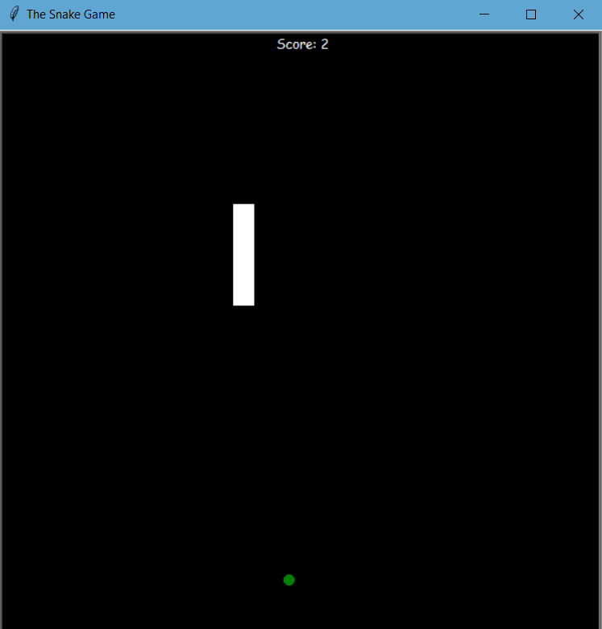
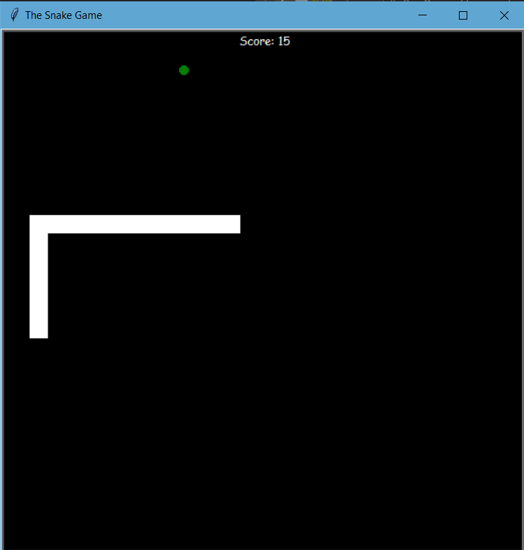
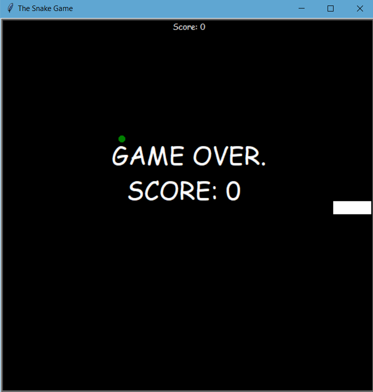

# Snake Game 🐍
A simple python program that simulates the gameplay of the legendary snake game from old phones and brick games.
GUI module used: [Turtle](https://docs.python.org/3/library/turtle.html)

## Clone the Project
Use the clone [link](https://github.com/caykay/AnimatedStar) provided, to clone this project.
```bash
git clone https://github.com/caykay/snake-game.git
```

## Install required modules
Use the package manager [pip](https://pip.pypa.io/en/stable/) to install all required packages/modules.
On your command line navigate to the repository root/folder and execute the following line.

```bash
pip install -r requirements.txt
```

## GAMEPLAY
The main objective is to direct the snake towards the food (small green item).
The more food the snake eats the more it grows.
The game follows the same old rules.
- To move use the up, down, right and left direction keys.
- The snake cannot turn to the opposite of the direction its facing.
- _You cannot go past walls (Not particularly an old rule but may change)_
- Try avoiding biting yourself otherwise it's game over for you.

### Gameplay screenshots
- This is what the game screen looks like


- This is what it looks like when you are being careful xD.


- And this is what it looks like when you lose.

